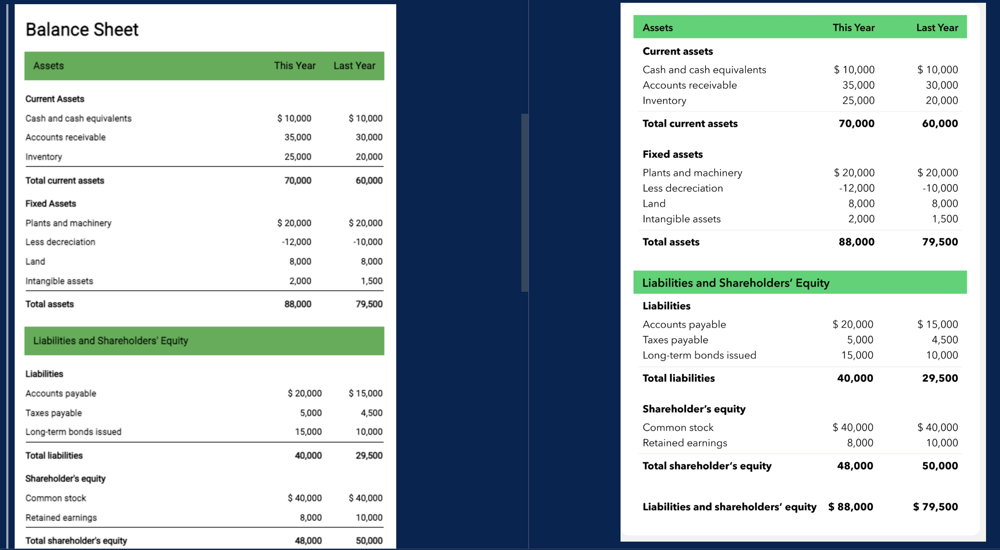

# colorsCSS

## Description

Learning a bit of accessibility, specifically how to hide for screen readers. Project is a duplicate of a balance sheet from freeCodeCamp.

## Table of Contents

-[Installation](#installation)

-[Usage](#Usage)

-[Demo](#demo)

-[License](#license)

-[Contributing](#contributing)

-[Tests](#tests)

-[Questions](#questions)

## Installation

n/a

## Usage

Just an exercise, repo not deployed.

## Demo

## License

This project is licensed under [MIT](https://opensource.org/licenses/MIT) license.

## Contributing

n/a

## Tests

n/a

## Questions

If you have any questions about the repo, open an issue or contact me directly at egomezfax19@gmail.com. You can find more of my work at [www.github.com/egome019](https://github.com/egome019)
